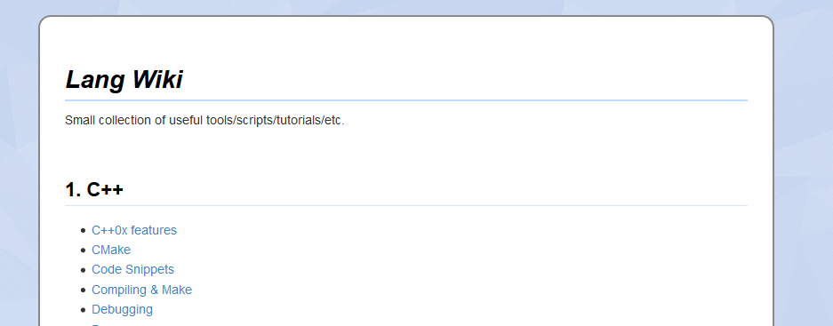

Markdown Wiki
=============

A small script that uses [pandoc](http://pandoc.org/) to generate static html sites
out of a file hirarchie of [markdown](https://de.wikipedia.org/wiki/Markdown) files.
A useful editor to write Markdown files is [MarkdownPad](http://markdownpad.com/).

The generated Wiki looks like:

All other description is found in the script itself.

